# MarkdownOffice

## AI-native Document Operating System for Enterprise Knowledge

<div class="mt-6 text-lg opacity-80 max-w-180 mx-auto">
MarkdownOffice biến document, slide, sheet và workflow thành <b>structured, versioned, auditable, machine-readable</b> knowledge để con người và AI Agent cùng làm việc.
</div>

<div class="mt-10">

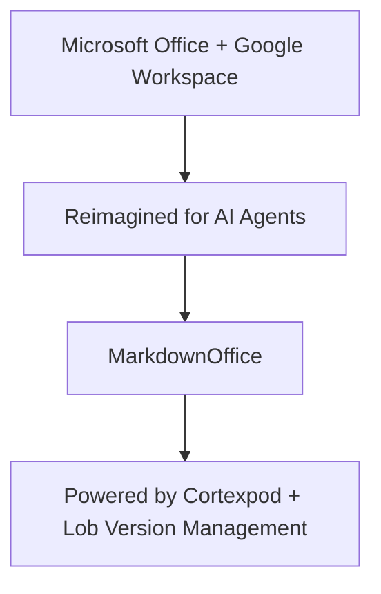

</div>

<!--
MarkdownOffice không phải một Markdown editor mới. Đây là nỗ lực xây dựng lại nền tảng tài liệu doanh nghiệp cho thời đại human + AI Agent.
-->

---
transition: fade-out
---

# Agenda

## 5 câu hỏi lớn deck này sẽ trả lời

<div v-click>

1. Doanh nghiệp hiện nay đang mất gì vì document phân tán?
2. Vì sao AI Agent cần một document workspace mới?
3. MarkdownOffice giải quyết bằng kiến trúc nào?
4. Cortexpod và Lob đóng vai trò gì?
5. Vì sao đây có thể trở thành nền tảng enterprise knowledge automation dài hạn?

</div>

<!--
Slide này định vị deck: đây không phải một product demo nhỏ, mà là một câu chuyện kiến trúc và tầm nhìn nền tảng.
-->

---
transition: slide-left
---

# Enterprise knowledge is fragmented across tools

Tài liệu doanh nghiệp nằm rải rác trong Docs, Slides, Sheets, Slack, Jira, email, file server và local laptop, khiến automation và governance trở nên rất khó.

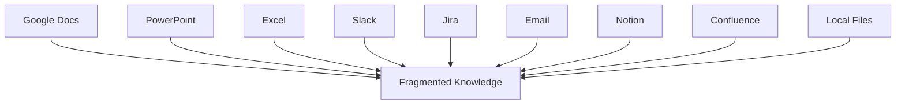

<!--
Doanh nghiệp không thiếu tài liệu. Vấn đề là không có một canonical knowledge layer để biết đâu là source of truth, ai sửa gì, và Agent nên dựa vào dữ liệu nào.
-->

---
class: px-14
---

# Office tools are human-friendly, but not Agent-native

Word, PowerPoint, Excel và Google Workspace có UI tốt cho con người, nhưng không cung cấp đủ cấu trúc, graph, version control, provenance và policy để AI Agent làm việc an toàn.

| Need              | Traditional Office | MarkdownOffice |
| ------------------ | ------------------- | -------------- |
| Human UI            | Strong               | Strong         |
| Machine-readable    | Limited              | Native         |
| Version control     | Partial              | Core           |
| Document graph      | Weak                 | Native         |
| Agent workflow      | External             | Native         |
| Audit               | Limited              | Deep           |

<!--
Agent không chỉ cần đọc text. Agent cần biết source, permission, version, dependency, approval state và impact của thay đổi.
-->

---
transition: slide-left
---

# MarkdownOffice is a Document Operating System

MarkdownOffice quản lý document như structured data, không phải file cô lập.

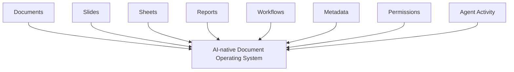

<!--
Khi document trở thành structured data, chúng ta có thể version, validate, link, query, automate và audit toàn bộ knowledge của tổ chức.
-->

---
class: px-14
---

# Rebuilding Office + GitHub + Git for AI Agent workflows

MarkdownOffice không đứng một mình. Nó nằm trong hệ sinh thái Cortexpod và Lob.

| Existing World                        | New Ecosystem                   |
| --------------------------------------- | --------------------------------- |
| Microsoft Office / Google Workspace     | MarkdownOffice                    |
| Word / Google Docs                      | MarkdownDoc                       |
| PowerPoint / Google Slides              | MarkdownSlide                     |
| Excel / Google Sheets                   | MarkdownSheet                     |
| GitHub                                  | Cortexpod                         |
| Git                                     | Lob                               |
| Pull Request                            | Agent Proposal                    |
| Commit                                  | Auditable Document Transaction    |

<!--
Chúng ta không chỉ build editor. Chúng ta build một stack mới cho enterprise knowledge: Office-like interface, GitHub-like hub và Git-like version layer.
-->

---
transition: slide-left
---

# Markdown-native source of truth

Tất cả document, slide và sheet được lưu bằng Markdown hoặc text-based format có thể diff, parse, validate và version.

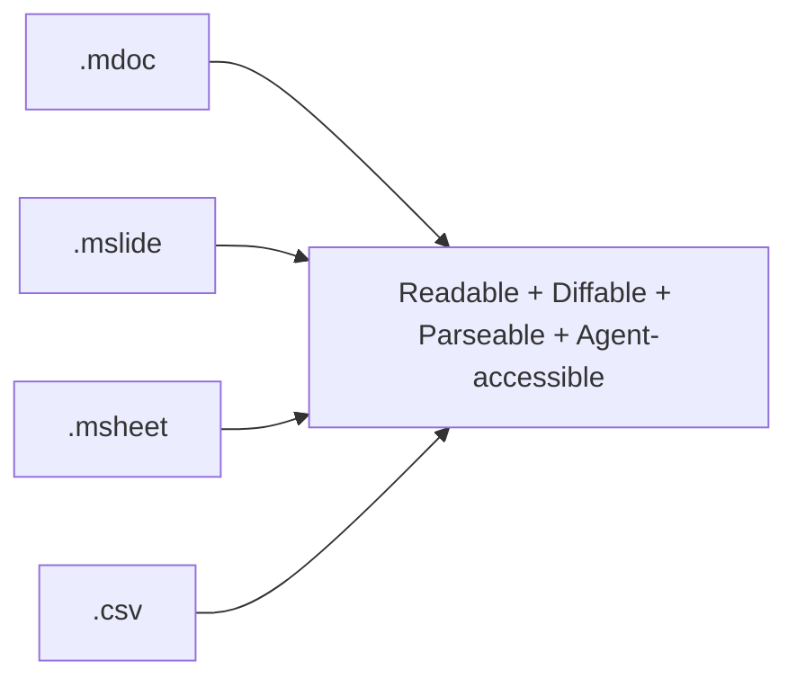

<!--
Người dùng vẫn thấy Word, PowerPoint và Excel-like interface. Nhưng bên dưới, source of truth là Markdown-native để Agent và version system có thể hiểu chính xác.
-->

---
transition: slide-left
---

# One knowledge engine, multiple Office views

MarkdownOffice có một core engine chung cho MarkdownDoc, MarkdownSlide và MarkdownSheet.

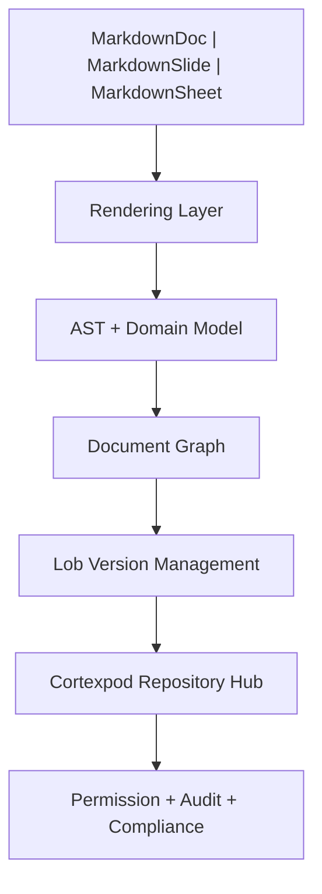

<!--
Ba sản phẩm không phải ba app tách rời. Chúng dùng chung AST, graph, permission, version, audit và Agent workflow.
-->

---
transition: slide-left
---

# AST turns documents into programmable knowledge

MarkdownOffice parse document thành AST để hỗ trợ rendering, validation, diff, merge, graph extraction và Agent interaction.

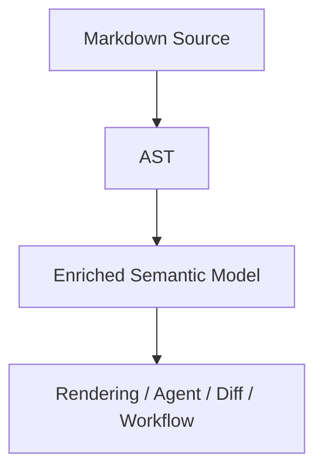

<!--
AST giúp Agent sửa đúng section, cập nhật đúng table, tạo slide từ đúng source và rollback đúng block thay vì xử lý document như text thô.
-->

---
transition: slide-left
---

# Documents become a knowledge graph

Mỗi document là một node trong graph, liên kết với section, table, slide, chart, service, owner, incident, task và approval state.

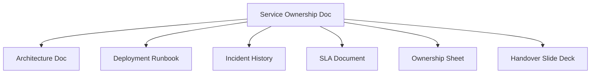

<!--
Document graph cho phép impact analysis, stale detection, source tracking và automatic report/slide generation.
-->


---
theme: seriph
background: https://cover.sli.dev
title: MarkdownOffice — AI-native Document Operating System for Enterprise Knowledge
info: |
  ## MarkdownOffice
  AI-native Document Operating System cho Enterprise Knowledge.

  Deck này không trình bày MarkdownOffice như một Markdown editor, mà như một
  **enterprise document monorepo + AI-native Office suite + Git-like version
  system** cho organizational knowledge.

  Deck trả lời 5 câu hỏi lớn:
  1. Doanh nghiệp hiện nay đang mất gì vì document phân tán?
  2. Vì sao AI Agent cần một document workspace mới?
  3. MarkdownOffice giải quyết bằng kiến trúc nào?
  4. Cortexpod và Lob đóng vai trò gì?
  5. Vì sao đây có thể trở thành nền tảng enterprise knowledge automation dài hạn?
class: text-center
drawings:
  persist: false
transition: slide-left
comark: true
---

# MarkdownOffice

## AI-native Document Operating System for Enterprise Knowledge

<div class="mt-6 text-lg opacity-80 max-w-180 mx-auto">
MarkdownOffice biến document, slide, sheet và workflow thành <b>structured, versioned, auditable, machine-readable</b> knowledge để con người và AI Agent cùng làm việc.
</div>

<div class="mt-10">


</div>

<!--
MarkdownOffice không phải một Markdown editor mới. Đây là nỗ lực xây dựng lại nền tảng tài liệu doanh nghiệp cho thời đại human + AI Agent.
-->

---
transition: fade-out
---

# Agenda

## 5 câu hỏi lớn deck này sẽ trả lời

<div v-click>

1. Doanh nghiệp hiện nay đang mất gì vì document phân tán?
2. Vì sao AI Agent cần một document workspace mới?
3. MarkdownOffice giải quyết bằng kiến trúc nào?
4. Cortexpod và Lob đóng vai trò gì?
5. Vì sao đây có thể trở thành nền tảng enterprise knowledge automation dài hạn?

</div>

<!--
Slide này định vị deck: đây không phải một product demo nhỏ, mà là một câu chuyện kiến trúc và tầm nhìn nền tảng.
-->

---
transition: slide-left
---

# Enterprise knowledge is fragmented across tools

Tài liệu doanh nghiệp nằm rải rác trong Docs, Slides, Sheets, Slack, Jira, email, file server và local laptop, khiến automation và governance trở nên rất khó.


<!--
Doanh nghiệp không thiếu tài liệu. Vấn đề là không có một canonical knowledge layer để biết đâu là source of truth, ai sửa gì, và Agent nên dựa vào dữ liệu nào.
-->

---
class: px-14
---

# Office tools are human-friendly, but not Agent-native

Word, PowerPoint, Excel và Google Workspace có UI tốt cho con người, nhưng không cung cấp đủ cấu trúc, graph, version control, provenance và policy để AI Agent làm việc an toàn.

| Need              | Traditional Office | MarkdownOffice |
| ------------------ | ------------------- | -------------- |
| Human UI            | Strong               | Strong         |
| Machine-readable    | Limited              | Native         |
| Version control     | Partial              | Core           |
| Document graph      | Weak                 | Native         |
| Agent workflow      | External             | Native         |
| Audit               | Limited              | Deep           |

<!--
Agent không chỉ cần đọc text. Agent cần biết source, permission, version, dependency, approval state và impact của thay đổi.
-->

---
transition: slide-left
---

# MarkdownOffice is a Document Operating System

MarkdownOffice quản lý document như structured data, không phải file cô lập.


<!--
Khi document trở thành structured data, chúng ta có thể version, validate, link, query, automate và audit toàn bộ knowledge của tổ chức.
-->

---
class: px-14
---

# Rebuilding Office + GitHub + Git for AI Agent workflows

MarkdownOffice không đứng một mình. Nó nằm trong hệ sinh thái Cortexpod và Lob.

| Existing World                        | New Ecosystem                   |
| --------------------------------------- | --------------------------------- |
| Microsoft Office / Google Workspace     | MarkdownOffice                    |
| Word / Google Docs                      | MarkdownDoc                       |
| PowerPoint / Google Slides              | MarkdownSlide                     |
| Excel / Google Sheets                   | MarkdownSheet                     |
| GitHub                                  | Cortexpod                         |
| Git                                     | Lob                               |
| Pull Request                            | Agent Proposal                    |
| Commit                                  | Auditable Document Transaction    |

<!--
Chúng ta không chỉ build editor. Chúng ta build một stack mới cho enterprise knowledge: Office-like interface, GitHub-like hub và Git-like version layer.
-->

---
transition: slide-left
---

# Markdown-native source of truth

Tất cả document, slide và sheet được lưu bằng Markdown hoặc text-based format có thể diff, parse, validate và version.


<!--
Người dùng vẫn thấy Word, PowerPoint và Excel-like interface. Nhưng bên dưới, source of truth là Markdown-native để Agent và version system có thể hiểu chính xác.
-->

---
transition: slide-left
---

# One knowledge engine, multiple Office views

MarkdownOffice có một core engine chung cho MarkdownDoc, MarkdownSlide và MarkdownSheet.


<!--
Ba sản phẩm không phải ba app tách rời. Chúng dùng chung AST, graph, permission, version, audit và Agent workflow.
-->

---
transition: slide-left
---

# AST turns documents into programmable knowledge

MarkdownOffice parse document thành AST để hỗ trợ rendering, validation, diff, merge, graph extraction và Agent interaction.


<!--
AST giúp Agent sửa đúng section, cập nhật đúng table, tạo slide từ đúng source và rollback đúng block thay vì xử lý document như text thô.
-->

---
transition: slide-left
---

# Documents become a knowledge graph

Mỗi document là một node trong graph, liên kết với section, table, slide, chart, service, owner, incident, task và approval state.


<!--
Document graph cho phép impact analysis, stale detection, source tracking và automatic report/slide generation.
-->

---
class: px-14
---

# Three products, one knowledge model

MarkdownDoc, MarkdownSlide và MarkdownSheet là ba surface chính cho narrative, presentation và structured table knowledge.

| Product       | Similar to                 | Primary role         |
| ------------- | --------------------------- | --------------------- |
| MarkdownDoc   | Word / Google Docs          | Narrative documents    |
| MarkdownSlide | PowerPoint / Google Slides  | Presentations          |
| MarkdownSheet | Excel / Google Sheets       | Structured tables      |

<!--
MarkdownDoc giải thích, MarkdownSheet tính toán và tracking, MarkdownSlide trình bày. Cả ba liên kết qua document graph.
-->

---
layout: two-cols
layoutClass: gap-8
---

# MarkdownDoc

## Word-like documents for AI-native enterprises

MarkdownDoc tạo report, spec, policy, runbook, handover document và knowledge base với Markdown-native source.

<div class="mt-6 p-4 rounded border border-main">
📄 <b>Word-like Viewer</b><br>
<span class="opacity-70 text-sm">Report / Spec / Policy / Runbook / Handover Doc</span>
</div>

::right::

<div class="mt-14 text-sm">

```md
# Service Handover Report

## Owner: platform-team
## Status: Active

- Dependency: PaymentService
- SLA: 99.9%
```

</div>

<div class="mt-4 p-4 rounded border border-main">
🌳 <b>Markdown Source + AST</b><br>
<span class="opacity-70 text-sm">Structured, diffable, Agent-readable</span>
</div>

<!--
User có trải nghiệm giống Word. Agent có structured source để đọc, sửa, validate và propose thay đổi.
-->

---
transition: slide-left
---

# MarkdownSheet

## Excel-like structured workflow data

MarkdownSheet biến table, CSV, formula, tracking matrix và dashboard thành versioned, auditable, Agent-readable data.

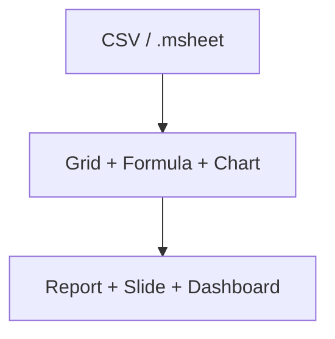

<!--
MarkdownSheet không cần clone Excel ngay từ đầu. Nó nên bắt đầu từ workflow matrix, status tracking, risk scoring và chart/report integration.
-->

---
transition: slide-left
---

# MarkdownSlide

## PowerPoint-like presentations generated from knowledge graph

MarkdownSlide tạo deck từ report, sheet, service metadata, issue history và dependency graph.

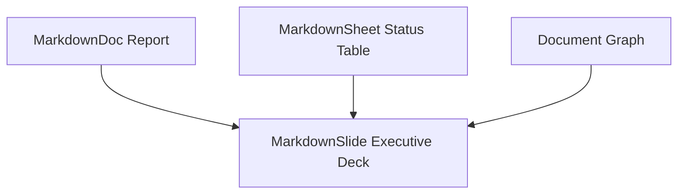

<!--
Slide không còn là file copy-paste dễ stale. Slide có source reference, stale detection và có thể refresh theo policy.
-->

---
transition: fade-out
---

# Cortexpod

## GitHub for enterprise documents and Agents

Cortexpod là centralized hub cho document repository, permission, review, Agent workspace, workflow, search, audit và knowledge graph.

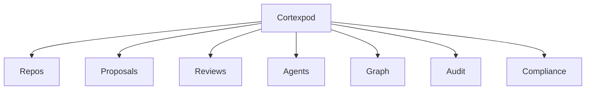

<!--
Cortexpod là control plane. Nó không chỉ lưu file, mà quản lý toàn bộ lifecycle của enterprise knowledge.
-->

---
transition: slide-left
---

# Lob

## Git-like version management for documents and Agent workflows

Lob cung cấp commit, branch, diff, merge, rollback và audit cho document, slide, sheet và Agent-generated artifacts.

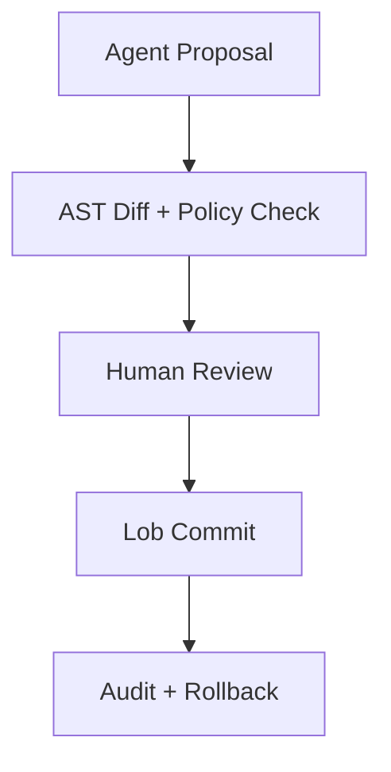

<!--
Git line diff không đủ cho document. Lob cần block diff, AST diff, slide diff, sheet diff và policy-based merge.
-->

---
transition: slide-left
---

# Agents propose, humans approve, Lob commits

AI Agent không tự ý sửa enterprise knowledge. Agent tạo proposal có reasoning, source reference, validation result và affected files.

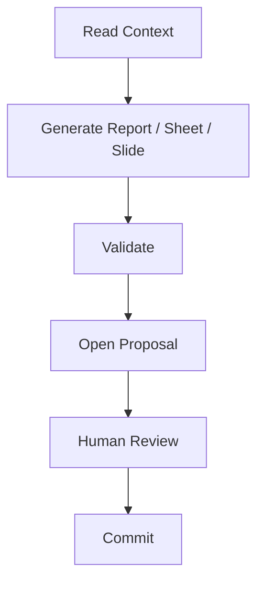

<!--
Đây là cách đưa AI vào doanh nghiệp an toàn: Agent có năng lực tạo artifact, nhưng thay đổi quan trọng đi qua review, policy và audit.
-->

---
transition: slide-left
---

# Use Case: Employee Handover Package

MarkdownOffice giúp Agent tạo handover package gồm transfer sheet, handover report và presentation deck từ scattered knowledge.

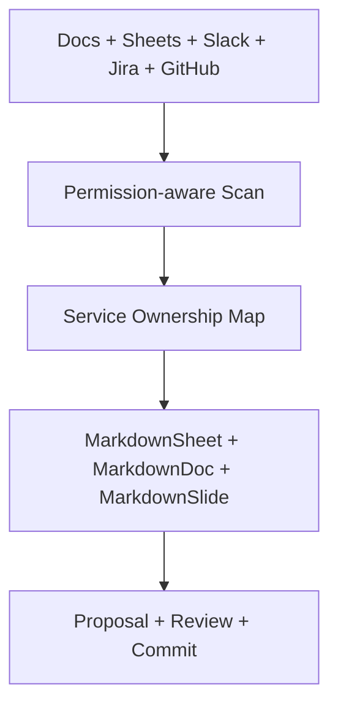

<!--
Handover là use case rất mạnh vì nó cho thấy pain point thật: tri thức phân tán, ownership không rõ, risk cao và thiếu audit.
-->

---
transition: slide-left
---

# From document graph to presentation

MarkdownOffice tạo pipeline thống nhất từ document sang sheet, từ sheet sang slide, từ slide sang presentation, sau đó ghi lại review và commit.

```mermaid {scale: 0.5}
graph TD
  A[Source Docs] --> B[Structured Extraction]
  B --> C[MarkdownSheet Metrics]
  C --> D[MarkdownDoc Report]
  D --> E[MarkdownSlide Deck]
  E --> F[Presentation]
  F --> G["Feedback + Lob Commit"]
```

<!--
Đây là điểm khác biệt với Office truyền thống: report, sheet và slide không phải ba file rời rạc, mà là một knowledge pipeline có version và audit.
-->

---
transition: slide-left
---

# Enterprise trust requires permission, audit and compliance

MarkdownOffice kiểm soát Agent bằng permission, proposal, policy, validation, reviewer và audit trail.

<div class="flex flex-col gap-2 mt-8 max-w-140 mx-auto">
  <div class="p-3 rounded border border-main bg-primary/5">🔐 Permission Scope</div>
  <div class="p-3 rounded border border-main bg-primary/10">📋 Policy Check</div>
  <div class="p-3 rounded border border-main bg-primary/15">✅ Validation</div>
  <div class="p-3 rounded border border-main bg-primary/20">👤 Human Review</div>
  <div class="p-3 rounded border border-main bg-primary/25">✍️ Signed Transaction</div>
  <div class="p-3 rounded border border-main bg-primary/30">🗂️ Audit Trail</div>
  <div class="p-3 rounded border border-main bg-primary/35">↩️ Rollback</div>
</div>

<!--
Enterprise không chỉ cần AI tạo nhanh. Họ cần AI tạo đúng quyền, có nguồn, có reviewer, có rollback và có bằng chứng audit.
-->

---
theme: seriph
background: https://cover.sli.dev
title: MarkdownOffice — AI-native Document Operating System for Enterprise Knowledge
info: |
  ## MarkdownOffice
  AI-native Document Operating System cho Enterprise Knowledge.

  Deck này không trình bày MarkdownOffice như một Markdown editor, mà như một
  **enterprise document monorepo + AI-native Office suite + Git-like version
  system** cho organizational knowledge.

  Deck trả lời 5 câu hỏi lớn:
  1. Doanh nghiệp hiện nay đang mất gì vì document phân tán?
  2. Vì sao AI Agent cần một document workspace mới?
  3. MarkdownOffice giải quyết bằng kiến trúc nào?
  4. Cortexpod và Lob đóng vai trò gì?
  5. Vì sao đây có thể trở thành nền tảng enterprise knowledge automation dài hạn?
class: text-center
drawings:
  persist: false
transition: slide-left
comark: true
---

# MarkdownOffice

## AI-native Document Operating System for Enterprise Knowledge

<div class="mt-6 text-lg opacity-80 max-w-180 mx-auto">
MarkdownOffice biến document, slide, sheet và workflow thành <b>structured, versioned, auditable, machine-readable</b> knowledge để con người và AI Agent cùng làm việc.
</div>

<div class="mt-10">

```mermaid {scale: 0.75}
graph TD
  A["Microsoft Office + Google Workspace"] --> B["Reimagined for AI Agents"]
  B --> C["MarkdownOffice"]
  C --> D["Powered by Cortexpod + Lob Version Management"]
```

</div>

<!--
MarkdownOffice không phải một Markdown editor mới. Đây là nỗ lực xây dựng lại nền tảng tài liệu doanh nghiệp cho thời đại human + AI Agent.
-->

---
transition: fade-out
---

# Agenda

## 5 câu hỏi lớn deck này sẽ trả lời

<div v-click>

1. Doanh nghiệp hiện nay đang mất gì vì document phân tán?
2. Vì sao AI Agent cần một document workspace mới?
3. MarkdownOffice giải quyết bằng kiến trúc nào?
4. Cortexpod và Lob đóng vai trò gì?
5. Vì sao đây có thể trở thành nền tảng enterprise knowledge automation dài hạn?

</div>

<!--
Slide này định vị deck: đây không phải một product demo nhỏ, mà là một câu chuyện kiến trúc và tầm nhìn nền tảng.
-->

---
transition: slide-left
---

# Enterprise knowledge is fragmented across tools

Tài liệu doanh nghiệp nằm rải rác trong Docs, Slides, Sheets, Slack, Jira, email, file server và local laptop, khiến automation và governance trở nên rất khó.

```mermaid {scale: 0.7}
graph TD
  A[Google Docs] --> F[Fragmented Knowledge]
  B[PowerPoint] --> F
  C[Excel] --> F
  D[Slack] --> F
  E[Jira] --> F
  G[Email] --> F
  H[Notion] --> F
  I[Confluence] --> F
  J[Local Files] --> F
```

<!--
Doanh nghiệp không thiếu tài liệu. Vấn đề là không có một canonical knowledge layer để biết đâu là source of truth, ai sửa gì, và Agent nên dựa vào dữ liệu nào.
-->

---
class: px-14
---

# Office tools are human-friendly, but not Agent-native

Word, PowerPoint, Excel và Google Workspace có UI tốt cho con người, nhưng không cung cấp đủ cấu trúc, graph, version control, provenance và policy để AI Agent làm việc an toàn.

| Need              | Traditional Office | MarkdownOffice |
| ------------------ | ------------------- | -------------- |
| Human UI            | Strong               | Strong         |
| Machine-readable    | Limited              | Native         |
| Version control     | Partial              | Core           |
| Document graph      | Weak                 | Native         |
| Agent workflow      | External             | Native         |
| Audit               | Limited              | Deep           |

<!--
Agent không chỉ cần đọc text. Agent cần biết source, permission, version, dependency, approval state và impact của thay đổi.
-->

---
transition: slide-left
---

# MarkdownOffice is a Document Operating System

MarkdownOffice quản lý document như structured data, không phải file cô lập.

```mermaid {scale: 0.7}
graph TD
  A[Documents] --> H[AI-native Document Operating System]
  B[Slides] --> H
  C[Sheets] --> H
  D[Reports] --> H
  E[Workflows] --> H
  F[Metadata] --> H
  G[Permissions] --> H
  I[Agent Activity] --> H
```

<!--
Khi document trở thành structured data, chúng ta có thể version, validate, link, query, automate và audit toàn bộ knowledge của tổ chức.
-->

---
class: px-14
---

# Rebuilding Office + GitHub + Git for AI Agent workflows

MarkdownOffice không đứng một mình. Nó nằm trong hệ sinh thái Cortexpod và Lob.

| Existing World                        | New Ecosystem                   |
| --------------------------------------- | --------------------------------- |
| Microsoft Office / Google Workspace     | MarkdownOffice                    |
| Word / Google Docs                      | MarkdownDoc                       |
| PowerPoint / Google Slides              | MarkdownSlide                     |
| Excel / Google Sheets                   | MarkdownSheet                     |
| GitHub                                  | Cortexpod                         |
| Git                                     | Lob                               |
| Pull Request                            | Agent Proposal                    |
| Commit                                  | Auditable Document Transaction    |

<!--
Chúng ta không chỉ build editor. Chúng ta build một stack mới cho enterprise knowledge: Office-like interface, GitHub-like hub và Git-like version layer.
-->

---
transition: slide-left
---

# Markdown-native source of truth

Tất cả document, slide và sheet được lưu bằng Markdown hoặc text-based format có thể diff, parse, validate và version.

```mermaid {scale: 0.7}
graph LR
  A[".mdoc"] --> E["Readable + Diffable + Parseable + Agent-accessible"]
  B[".mslide"] --> E
  C[".msheet"] --> E
  D[".csv"] --> E
```

<!--
Người dùng vẫn thấy Word, PowerPoint và Excel-like interface. Nhưng bên dưới, source of truth là Markdown-native để Agent và version system có thể hiểu chính xác.
-->

---
transition: slide-left
---

# One knowledge engine, multiple Office views

MarkdownOffice có một core engine chung cho MarkdownDoc, MarkdownSlide và MarkdownSheet.

```mermaid {scale: 0.55}
graph TD
  A["MarkdownDoc | MarkdownSlide | MarkdownSheet"] --> B[Rendering Layer]
  B --> C[AST + Domain Model]
  C --> D[Document Graph]
  D --> E[Lob Version Management]
  E --> F[Cortexpod Repository Hub]
  F --> G[Permission + Audit + Compliance]
```

<!--
Ba sản phẩm không phải ba app tách rời. Chúng dùng chung AST, graph, permission, version, audit và Agent workflow.
-->

---
transition: slide-left
---

# AST turns documents into programmable knowledge

MarkdownOffice parse document thành AST để hỗ trợ rendering, validation, diff, merge, graph extraction và Agent interaction.

```mermaid {scale: 0.7}
graph TD
  A[Markdown Source] --> B[AST]
  B --> C[Enriched Semantic Model]
  C --> D["Rendering / Agent / Diff / Workflow"]
```

<!--
AST giúp Agent sửa đúng section, cập nhật đúng table, tạo slide từ đúng source và rollback đúng block thay vì xử lý document như text thô.
-->

---
transition: slide-left
---

# Documents become a knowledge graph

Mỗi document là một node trong graph, liên kết với section, table, slide, chart, service, owner, incident, task và approval state.

```mermaid {scale: 0.6}
graph TD
  A[Service Ownership Doc] --> B[Architecture Doc]
  A --> C[Deployment Runbook]
  A --> D[Incident History]
  A --> E[SLA Document]
  A --> F[Ownership Sheet]
  A --> G[Handover Slide Deck]
```

<!--
Document graph cho phép impact analysis, stale detection, source tracking và automatic report/slide generation.
-->

---
class: px-14
---

# Three products, one knowledge model

MarkdownDoc, MarkdownSlide và MarkdownSheet là ba surface chính cho narrative, presentation và structured table knowledge.

| Product       | Similar to                 | Primary role         |
| ------------- | --------------------------- | --------------------- |
| MarkdownDoc   | Word / Google Docs          | Narrative documents    |
| MarkdownSlide | PowerPoint / Google Slides  | Presentations          |
| MarkdownSheet | Excel / Google Sheets       | Structured tables      |

<!--
MarkdownDoc giải thích, MarkdownSheet tính toán và tracking, MarkdownSlide trình bày. Cả ba liên kết qua document graph.
-->

---
layout: two-cols
layoutClass: gap-8
---

# MarkdownDoc

## Word-like documents for AI-native enterprises

MarkdownDoc tạo report, spec, policy, runbook, handover document và knowledge base với Markdown-native source.

<div class="mt-6 p-4 rounded border border-main">
📄 <b>Word-like Viewer</b><br>
<span class="opacity-70 text-sm">Report / Spec / Policy / Runbook / Handover Doc</span>
</div>

::right::

<div class="mt-14 text-sm">

```md
# Service Handover Report

## Owner: platform-team
## Status: Active

- Dependency: PaymentService
- SLA: 99.9%
```

</div>

<div class="mt-4 p-4 rounded border border-main">
🌳 <b>Markdown Source + AST</b><br>
<span class="opacity-70 text-sm">Structured, diffable, Agent-readable</span>
</div>

<!--
User có trải nghiệm giống Word. Agent có structured source để đọc, sửa, validate và propose thay đổi.
-->

---
transition: slide-left
---

# MarkdownSheet

## Excel-like structured workflow data

MarkdownSheet biến table, CSV, formula, tracking matrix và dashboard thành versioned, auditable, Agent-readable data.

```mermaid {scale: 0.7}
graph TD
  A["CSV / .msheet"] --> B["Grid + Formula + Chart"]
  B --> C["Report + Slide + Dashboard"]
```

<!--
MarkdownSheet không cần clone Excel ngay từ đầu. Nó nên bắt đầu từ workflow matrix, status tracking, risk scoring và chart/report integration.
-->

---
transition: slide-left
---

# MarkdownSlide

## PowerPoint-like presentations generated from knowledge graph

MarkdownSlide tạo deck từ report, sheet, service metadata, issue history và dependency graph.

```mermaid {scale: 0.7}
graph TD
  A[MarkdownDoc Report] --> D[MarkdownSlide Executive Deck]
  B[MarkdownSheet Status Table] --> D
  C[Document Graph] --> D
```

<!--
Slide không còn là file copy-paste dễ stale. Slide có source reference, stale detection và có thể refresh theo policy.
-->

---
transition: fade-out
---

# Cortexpod

## GitHub for enterprise documents and Agents

Cortexpod là centralized hub cho document repository, permission, review, Agent workspace, workflow, search, audit và knowledge graph.

```mermaid {scale: 0.6}
graph TD
  Core[Cortexpod] --> A[Repos]
  Core --> B[Proposals]
  Core --> C[Reviews]
  Core --> D[Agents]
  Core --> E[Graph]
  Core --> F[Audit]
  Core --> G[Compliance]
```

<!--
Cortexpod là control plane. Nó không chỉ lưu file, mà quản lý toàn bộ lifecycle của enterprise knowledge.
-->

---
transition: slide-left
---

# Lob

## Git-like version management for documents and Agent workflows

Lob cung cấp commit, branch, diff, merge, rollback và audit cho document, slide, sheet và Agent-generated artifacts.

```mermaid {scale: 0.65}
graph TD
  A[Agent Proposal] --> B["AST Diff + Policy Check"]
  B --> C[Human Review]
  C --> D[Lob Commit]
  D --> E["Audit + Rollback"]
```

<!--
Git line diff không đủ cho document. Lob cần block diff, AST diff, slide diff, sheet diff và policy-based merge.
-->

---
transition: slide-left
---

# Agents propose, humans approve, Lob commits

AI Agent không tự ý sửa enterprise knowledge. Agent tạo proposal có reasoning, source reference, validation result và affected files.

```mermaid {scale: 0.55}
graph TD
  A[Read Context] --> B["Generate Report / Sheet / Slide"]
  B --> C[Validate]
  C --> D[Open Proposal]
  D --> E[Human Review]
  E --> F[Commit]
```

<!--
Đây là cách đưa AI vào doanh nghiệp an toàn: Agent có năng lực tạo artifact, nhưng thay đổi quan trọng đi qua review, policy và audit.
-->

---
transition: slide-left
---

# Use Case: Employee Handover Package

MarkdownOffice giúp Agent tạo handover package gồm transfer sheet, handover report và presentation deck từ scattered knowledge.

```mermaid {scale: 0.6}
graph TD
  A["Docs + Sheets + Slack + Jira + GitHub"] --> B[Permission-aware Scan]
  B --> C[Service Ownership Map]
  C --> D["MarkdownSheet + MarkdownDoc + MarkdownSlide"]
  D --> E["Proposal + Review + Commit"]
```

<!--
Handover là use case rất mạnh vì nó cho thấy pain point thật: tri thức phân tán, ownership không rõ, risk cao và thiếu audit.
-->

---
transition: slide-left
---

# From document graph to presentation

MarkdownOffice tạo pipeline thống nhất từ document sang sheet, từ sheet sang slide, từ slide sang presentation, sau đó ghi lại review và commit.

```mermaid {scale: 0.5}
graph TD
  A[Source Docs] --> B[Structured Extraction]
  B --> C[MarkdownSheet Metrics]
  C --> D[MarkdownDoc Report]
  D --> E[MarkdownSlide Deck]
  E --> F[Presentation]
  F --> G["Feedback + Lob Commit"]
```

<!--
Đây là điểm khác biệt với Office truyền thống: report, sheet và slide không phải ba file rời rạc, mà là một knowledge pipeline có version và audit.
-->

---
transition: slide-left
---

# Enterprise trust requires permission, audit and compliance

MarkdownOffice kiểm soát Agent bằng permission, proposal, policy, validation, reviewer và audit trail.

<div class="flex flex-col gap-2 mt-8 max-w-140 mx-auto">
  <div class="p-3 rounded border border-main bg-primary/5">🔐 Permission Scope</div>
  <div class="p-3 rounded border border-main bg-primary/10">📋 Policy Check</div>
  <div class="p-3 rounded border border-main bg-primary/15">✅ Validation</div>
  <div class="p-3 rounded border border-main bg-primary/20">👤 Human Review</div>
  <div class="p-3 rounded border border-main bg-primary/25">✍️ Signed Transaction</div>
  <div class="p-3 rounded border border-main bg-primary/30">🗂️ Audit Trail</div>
  <div class="p-3 rounded border border-main bg-primary/35">↩️ Rollback</div>
</div>

<!--
Enterprise không chỉ cần AI tạo nhanh. Họ cần AI tạo đúng quyền, có nguồn, có reviewer, có rollback và có bằng chứng audit.
-->

---
transition: slide-left
---

# MarkdownOffice is not a tool — it is an enterprise knowledge platform

Khi toàn bộ document trở thành graph có version và Agent-accessible, MarkdownOffice có thể mở rộng sang onboarding, compliance, incident review, project reporting, audit, planning và executive automation.

<div class="text-center mt-4">
  <span class="text-2xl font-bold">MarkdownOffice</span>
  <div class="opacity-60 text-sm">Structured, versioned, Agent-accessible knowledge layer</div>
</div>

<div class="grid grid-cols-4 gap-3 mt-8 text-sm text-center">
  <div class="p-3 rounded border border-main">Handover</div>
  <div class="p-3 rounded border border-main">Onboarding</div>
  <div class="p-3 rounded border border-main">Incident Review</div>
  <div class="p-3 rounded border border-main">Compliance</div>
  <div class="p-3 rounded border border-main">Executive Reporting</div>
  <div class="p-3 rounded border border-main">Project Planning</div>
  <div class="p-3 rounded border border-main">Policy Management</div>
  <div class="p-3 rounded border border-main">Knowledge Automation</div>
</div>

<!--
Điểm mạnh dài hạn không nằm ở editor, mà nằm ở việc sở hữu structured knowledge layer của doanh nghiệp.
-->

---
transition: slide-left
---

# MVP roadmap

## Start with document workflow, expand to Office ecosystem

Không nên clone toàn bộ Microsoft Office ngay từ đầu. Nên bắt đầu từ MarkdownDoc + AST + version + Agent proposal, sau đó mở rộng sang Slide và Sheet.

<div class="flex flex-col gap-3 mt-6 text-sm">

<div v-click class="flex items-center gap-3">
<span class="rounded-full bg-primary/20 px-3 py-1 font-mono">Phase 1</span>
<span>MarkdownDoc + AST + Version History</span>
</div>

<div v-click class="flex items-center gap-3">
<span class="rounded-full bg-primary/20 px-3 py-1 font-mono">Phase 2</span>
<span>Cortexpod Repository + Proposal Workflow</span>
</div>

<div v-click class="flex items-center gap-3">
<span class="rounded-full bg-primary/20 px-3 py-1 font-mono">Phase 3</span>
<span>MarkdownSlide Generation</span>
</div>

<div v-click class="flex items-center gap-3">
<span class="rounded-full bg-primary/20 px-3 py-1 font-mono">Phase 4</span>
<span>MarkdownSheet Workflow Tables</span>
</div>

<div v-click class="flex items-center gap-3">
<span class="rounded-full bg-primary/20 px-3 py-1 font-mono">Phase 5</span>
<span>Document Graph + Automation</span>
</div>

<div v-click class="flex items-center gap-3">
<span class="rounded-full bg-primary/20 px-3 py-1 font-mono">Phase 6</span>
<span>Enterprise Permission + Audit + Compliance</span>
</div>

</div>

<!--
Build wedge nhỏ nhưng có giá trị cao: structured report generation và handover workflow. Sau đó mở rộng thành full enterprise document monorepo.
-->

---
transition: slide-left
---

# GitHub for enterprise documents. Microsoft Office for AI Agents.

MarkdownOffice có thể trở thành hệ điều hành Markdown-native cho organizational knowledge.

```mermaid {scale: 0.75}
graph TD
  A[GitHub-like Hub] --> C[Markdown-native OS]
  B[Office-like UI] --> C
  C --> D[AI Agent Workflows]
```

<!--
Định vị này giúp MarkdownOffice không bị so sánh như một editor nhỏ, mà trở thành một category mới: AI-native document operating system.
-->

---
layout: center
class: text-center
transition: fade-out
---

# The future of enterprise documents is structured, versioned and Agent-native

<div class="text-sm opacity-70 max-w-160 mx-auto mt-2">
MarkdownOffice biến tài liệu từ file tĩnh thành hệ thống tri thức sống, nơi con người và AI Agent có thể cùng tạo, review, version, trình bày và tự động hóa.
</div>

<div class="mt-8 text-left inline-block">

| Before              | After                          |
| ------------------- | ------------------------------- |
| Scattered files      | Centralized document monorepo   |
| Manual copy-paste    | Graph-driven generation         |
| Weak versioning      | Lob-backed transactions         |
| Human-only editing   | Human + Agent collaboration     |
| Static slide         | Source-linked presentation      |
| Unclear audit        | Full traceability               |

</div>

<!--
Đây là cơ hội xây dựng lại nền tảng tài liệu doanh nghiệp từ đầu cho thời đại AI Agent.
-->
