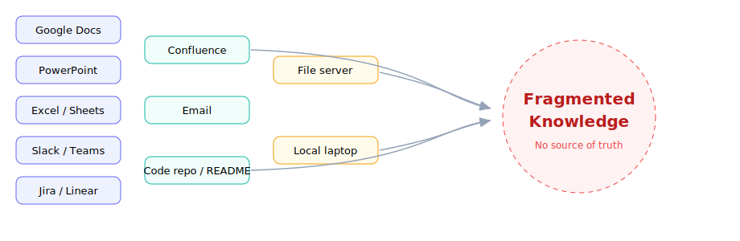
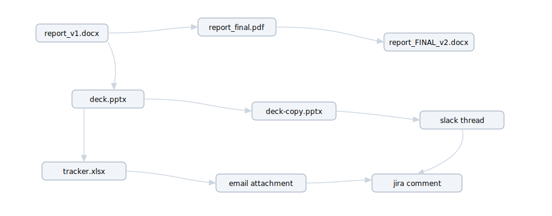
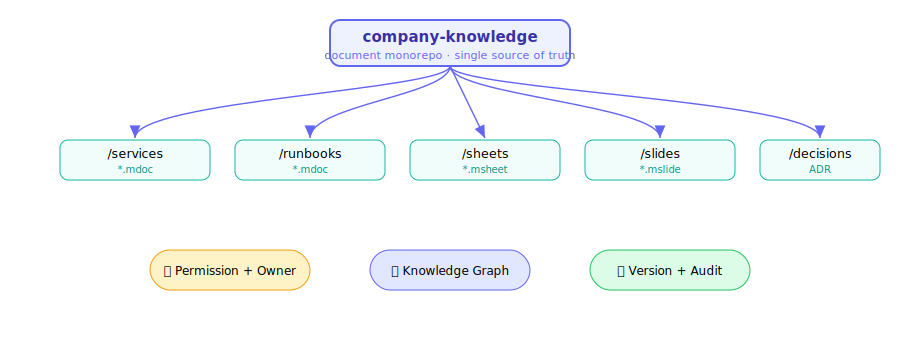

# 1 · Nỗi đau tài liệu doanh nghiệp
Fragmented knowledge - con người mệt mỏi, AI Agent thất bại

---
layout: default
---

# Doanh nghiệp không thiếu tài liệu - thiếu hệ điều hành cho tài liệu

Cùng một sự thật vận hành bị chia nhỏ và sao chép qua hàng chục công cụ, không có <b>canonical source of truth</b>.

<!--
Vấn đề không phải từng tool kém. Vấn đề là không có canonical knowledge layer để người, hệ thống và Agent cùng làm việc.
-->

---
layout: default
---

# Bối cảnh công cụ bị phân mảnh

Mỗi loại tri thức nằm ở một nơi khác nhau, với schema, permission, history và API khác nhau.

| Loại thông tin    | Nơi thường nằm                | Vấn đề khi cần tổng hợp            |
| ----------------- | ----------------------------- | ---------------------------------- |
| Report / Spec     | Google Docs, Word, PDF        | Nhiều bản, không rõ bản mới nhất   |
| Slide             | PowerPoint, Google Slides     | Copy-paste, dễ stale               |
| Sheet / Data      | Excel, Google Sheets          | Formula khó audit cross-doc        |
| Task              | Jira, Linear, Trello          | Tách rời khỏi tài liệu mô tả       |
| Chat context      | Slack, Teams                  | Quyết định chìm trong hội thoại    |
| Decision / Wiki   | Notion, Confluence, email     | Không có version thật, không owner |
| Service ownership | Wiki, sheet, tribal knowledge | Mất khi nhân sự nghỉ việc          |
| Incident history  | Jira, Slack, postmortem       | Rời rạc, khó trace                 |

⚠️ <b>Không có canonical layer</b> → không biết đâu là bản đúng, ai sửa gì, và Agent nên tin vào dữ liệu nào.

---
layout: two-cols
layoutClass: gap-8
---

# Vì sao con người mất context

🔍 <b>Săn lùng thông tin</b> Phải mở 6–8 tool để ghép lại một bức tranh.

🕰️ <b>Bản cũ vs bản mới</b> `final_v2_revised_latest.docx` - không ai chắc.

🧠 <b>Tribal knowledge</b> Kiến thức nằm trong đầu người, không được ghi lại.

🔗 <b>Mất liên kết</b> Slide không biết lấy từ sheet nào, report nào.

::right::

### Cái giá phải trả

- Onboarding chậm
- Handover rủi ro cao
- Quyết định dựa trên dữ liệu lỗi thời
- Không có audit trail khi cần

~20%+ 
thời gian tri thức bị đốt vào việc đi tìm lại thông tin

<!--
Context switching liên tục giữa các tool là thuế vô hình đánh vào mọi knowledge worker.
-->

---
layout: default
---

# Vì sao AI Agent thất bại với tài liệu phân mảnh

Office/Docs tối ưu cho <b>mắt người</b>, không cho <b>reasoning engine</b>. Agent chỉ "đọc text" chứ không "vận hành tài liệu".

### Agent không xác định được

❓ Đâu là version mới nhất / đã duyệt

❓ Ai owner, quyền truy cập tới đâu

❓ Bảng nào là source of truth

❓ Dữ liệu nào stale, đổi gì ảnh hưởng gì

### Hệ quả (theo Harness Engineering)

🌀 <b>Thiếu context</b> → hallucination

🚫 <b>Thiếu grounding</b> → bịa dữ kiện

🔒 <b>Thiếu permission model</b> → rủi ro

📝 <b>Thiếu audit/rollback</b> → không thể tin

<!--
"Agent reliability đến từ system design, không từ một prompt hay". Tài liệu phân mảnh chính là system design tồi cho Agent.
-->

---
layout: default
---

# Trạng thái hiện tại: document chaos

Sao chép chồng chéo · liên kết mờ · không version · không owner · không audit

---
layout: default
---

# Trạng thái mong muốn: enterprise document monorepo

Một cây tri thức duy nhất - có cấu trúc, có version, có graph, có audit - để người và Agent cùng vận hành.

<!--
Từ chaos sang monorepo: mọi artifact có cấu trúc, có graph, có version và audit.
-->

