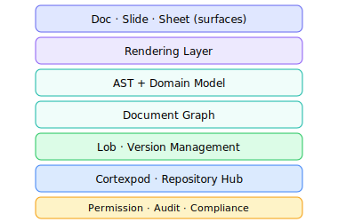
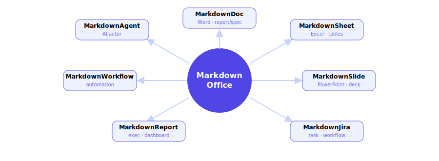
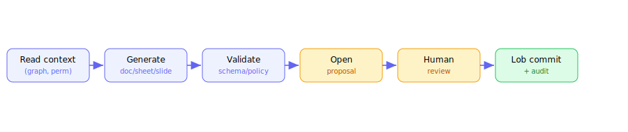
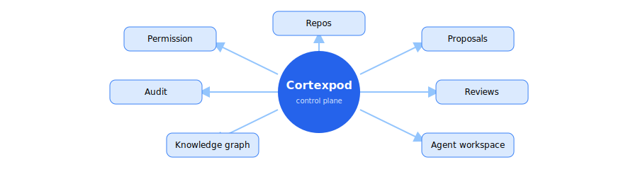
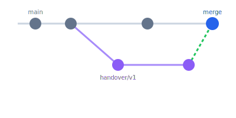

# 2 · Giới thiệu MarkdownOffice
Document Operating System - markdown-native, LLM-first

---
layout: two-cols
layoutClass: gap-6
---

# MarkdownOffice là gì?

<div class="mt-4 text-sm">

<!-- Không phải Markdown editor. Đây là <b>hệ điều hành tài liệu</b> cho doanh nghiệp: -->
MarkdownOffice là một markdown editor tập trung vào <b>structured · versioned · auditable · machine-readable</b> knowledge - để con người và AI Agent cùng tạo, review, version và tự động hóa.

- Tài liệu là <b>structured data</b>, không phải file cô lập
- <b>Markdown-native</b> làm source of truth, có thể diff/parse/validate
- <b>LLM-first</b>: Agent là first-class actor
- Có permission · version · graph · audit từ lõi

</div>

<div class="mt-4 p-3 rounded-lg border-l-4 border-indigo-500 bg-indigo-50 dark:bg-indigo-900/20 text-sm italic">
"Microsoft Office reimagined for AI Agents, running on a GitHub-like hub, powered by a Git-like version layer for structured documents."
</div>

::right::

<div class="flex items-center justify-center h-full">

</div>

<!--
Người dùng vẫn thấy Word/PowerPoint/Excel. Bên dưới là Markdown-native, machine-readable, agent-accessible.
-->

---
layout: default
---

# Core thesis: markdown-native + LLM-first

<div class="grid grid-cols-2 gap-6 mt-4">

<div>

### Vì sao Markdown-native?
<div class="text-sm mt-2 flex flex-col gap-1.5">
<div class="px-3 py-1.5 rounded bg-emerald-50 dark:bg-emerald-900/20">✅ Human-readable & machine-readable</div>
<div class="px-3 py-1.5 rounded bg-emerald-50 dark:bg-emerald-900/20">✅ Diff-friendly → version control tự nhiên</div>
<div class="px-3 py-1.5 rounded bg-emerald-50 dark:bg-emerald-900/20">✅ Portable, không lock vendor</div>
<div class="px-3 py-1.5 rounded bg-emerald-50 dark:bg-emerald-900/20">✅ LLM đã "quen" cấu trúc Markdown</div>
<div class="px-3 py-1.5 rounded bg-emerald-50 dark:bg-emerald-900/20">✅ Extensible: frontmatter, block ID, schema</div>
</div>

</div>

<div>

### Kiến trúc phân lớp


</div>

</div>

<!--
Một knowledge engine, nhiều Office view. Người dùng không bị bắt nhìn Markdown thô.
-->

---
layout: default
---

# MarkdownOffice ecosystem map

<div class="flex justify-center mt-2">

</div>

<div class="grid grid-cols-2 gap-3 text-xs mt-1">
<div class="px-3 py-1.5 rounded bg-blue-50 dark:bg-blue-900/20">🏛️ <b>Cortexpod</b> - GitHub-like hub cho document + Agent</div>
<div class="px-3 py-1.5 rounded bg-green-50 dark:bg-green-900/20">🔀 <b>Lob</b> - Git-like version layer cho structured docs</div>
</div>

<!--
Bảy surface chia sẻ chung một engine: content · AST · graph · permission · Lob · Cortexpod · agent layer.
-->

---
layout: two-cols
layoutClass: gap-6
---

# MarkdownDoc

## Word-like · Markdown-native

<div class="text-sm mt-2">
Report · spec · policy · runbook · handover · knowledge base - với source `.mdoc` có block ID.
</div>

```md
---
title: Service Handover Report
owner: platform-team
status: active
---
# Executive Summary
## Known Risks   {#risk}
- SLA: 99.9% · dep: PaymentService
```

<div class="mt-3 text-xs flex flex-col gap-1.5">
<div class="px-2 py-1 rounded bg-indigo-50 dark:bg-indigo-900/20">👀 <b>View:</b> Word-like, paginated, PDF export</div>
<div class="px-2 py-1 rounded bg-teal-50 dark:bg-teal-900/20">🌳 <b>Source:</b> Markdown + AST, diffable, agent-readable</div>
</div>

::right::

<div class="flex flex-col items-center justify-center h-full gap-3">
<!--  -->

</div>

<!--
User có trải nghiệm Word. Agent có structured source để đọc, sửa, validate và propose.
-->

---
layout: two-cols
layoutClass: gap-6
---

# MarkdownSheet

## Excel-like · CSV-first

<div class="text-sm mt-2">
Không clone toàn bộ Excel ngay. Bắt đầu từ <b>workflow data</b>: status tracking, ownership matrix, risk scoring.
</div>

<div class="mt-2 text-xs">

| Cột             | Vai trò              |
| --------------- | -------------------- |
| Service / Owner | ai nắm cái gì        |
| Documentation % | mức tài liệu hóa     |
| Risk Score      | crit × complex × gap |
| Completion %    | tiến độ handover     |

</div>

<div class="mt-2 p-2 rounded bg-teal-50 dark:bg-teal-900/20 text-xs">
🔗 Formula <b>dependency tracking</b>: đổi 1 ô → biết sheet/chart/slide/report nào cần refresh.
</div>

::right::

<div class="flex flex-col items-center justify-center h-full gap-3">
<!--  -->

</div>

<!--
MarkdownSheet là structured table engine, không chỉ spreadsheet.
-->

---
layout: two-cols
layoutClass: gap-6
---

# MarkdownSlide

## PowerPoint-like · sinh từ knowledge graph

<div class="text-sm mt-2">
Deck được <b>generate từ report + sheet + document graph</b> - không còn copy-paste tay.
</div>

<div class="mt-3 text-xs flex flex-col gap-1.5">
<div class="px-2 py-1 rounded bg-indigo-50 dark:bg-indigo-900/20">📊 Chart lấy trực tiếp từ MarkdownSheet</div>
<div class="px-2 py-1 rounded bg-indigo-50 dark:bg-indigo-900/20">🔗 Mỗi slide có <b>source reference</b></div>
<div class="px-2 py-1 rounded bg-amber-50 dark:bg-amber-900/20">🕰️ <b>Stale detection</b> khi source đổi</div>
<div class="px-2 py-1 rounded bg-emerald-50 dark:bg-emerald-900/20">🔄 Refresh theo policy · giữ snapshot audit</div>
</div>

<div class="mt-3 text-xs opacity-70">Deck này chính là một MarkdownSlide (chạy trên Slidev).</div>

::right::

<div class="flex flex-col items-center justify-center h-full gap-3">
<!--  -->

</div>

<!--
Slide không phải endpoint tĩnh, mà là view có version của knowledge pipeline.
-->

---
layout: default
---

# MarkdownJira - task & workflow gắn với tài liệu

Task không tách rời tài liệu mô tả nó. Issue là một node trong cùng document graph.

<div class="grid grid-cols-3 gap-4 mt-6 text-sm">

<div class="p-4 rounded-lg border border-gray-300 dark:border-gray-600">
<div class="text-2xl">📋</div>
<b>Issue = document-linked</b><br>
<span class="opacity-70">Mỗi task liên kết tới service doc, runbook, incident, owner.</span>
</div>

<div class="p-4 rounded-lg border border-gray-300 dark:border-gray-600">
<div class="text-2xl">🔗</div>
<b>Traceable</b><br>
<span class="opacity-70">Từ task → decision record → report → slide, tất cả trong monorepo.</span>
</div>

<div class="p-4 rounded-lg border border-gray-300 dark:border-gray-600">
<div class="text-2xl">🤖</div>
<b>Agent-actionable</b><br>
<span class="opacity-70">Agent đọc task, cập nhật status sheet, mở proposal - có audit.</span>
</div>

</div>

<div class="mt-6 p-3 rounded-lg border-l-4 border-indigo-500 bg-indigo-50 dark:bg-indigo-900/20 text-sm">
So với Jira truyền thống: task, mô tả, tài liệu và tiến độ nằm <b>cùng một knowledge layer có version</b>, không phải các silo tách rời.
</div>

---
layout: default
---

# MarkdownWorkflow & MarkdownReport

<div class="grid grid-cols-2 gap-6 mt-4">

<div>

### ⚙️ MarkdownWorkflow
<div class="text-sm mt-2 opacity-80">Automation layer cho các quy trình lặp lại:</div>
<div class="mt-2 text-xs flex flex-col gap-1.5">
<div class="px-2 py-1 rounded bg-violet-50 dark:bg-violet-900/20">Handover · Onboarding</div>
<div class="px-2 py-1 rounded bg-violet-50 dark:bg-violet-900/20">Incident review · Postmortem</div>
<div class="px-2 py-1 rounded bg-violet-50 dark:bg-violet-900/20">Policy approval · Compliance check</div>
<div class="px-2 py-1 rounded bg-violet-50 dark:bg-violet-900/20">Stale detection · Ownership refresh</div>
</div>

</div>

<div>

### 📈 MarkdownReport
<div class="text-sm mt-2 opacity-80">Executive & dashboard surface:</div>
<div class="mt-2 text-xs flex flex-col gap-1.5">
<div class="px-2 py-1 rounded bg-sky-50 dark:bg-sky-900/20">Document health · stale docs</div>
<div class="px-2 py-1 rounded bg-sky-50 dark:bg-sky-900/20">Missing owners · pending approvals</div>
<div class="px-2 py-1 rounded bg-sky-50 dark:bg-sky-900/20">High-risk services · open handovers</div>
<div class="px-2 py-1 rounded bg-sky-50 dark:bg-sky-900/20">Agent activity summary</div>
</div>

</div>

</div>

<div class="mt-5 p-3 rounded bg-slate-100 dark:bg-slate-800 text-xs font-mono">
Team Knowledge Health · 12 services · 3 thiếu backup owner · 5 runbook outdated · 4 agent proposals pending
</div>

---
layout: default
---

# MarkdownAgent - AI Agent là first-class actor

Agent không phải chatbot bên ngoài tài liệu. Nó làm việc theo <b>transaction</b>, không chỉ "generate text".

<div class="flex justify-center mt-4">

</div>

<div class="grid grid-cols-4 gap-2 text-xs mt-3">
<div class="px-2 py-1.5 rounded bg-gray-100 dark:bg-gray-800 text-center">Read · Retrieve</div>
<div class="px-2 py-1.5 rounded bg-gray-100 dark:bg-gray-800 text-center">Propose · Edit (scoped)</div>
<div class="px-2 py-1.5 rounded bg-gray-100 dark:bg-gray-800 text-center">Validate</div>
<div class="px-2 py-1.5 rounded bg-gray-100 dark:bg-gray-800 text-center">Commit (nếu policy cho phép)</div>
</div>

<!--
Agents propose, humans approve, Lob commits. Đây là cách đưa AI vào enterprise an toàn.
-->

---
layout: default
---

# Cortexpod - GitHub cho enterprise documents & Agents

Control plane cho toàn bộ lifecycle của enterprise knowledge - không chỉ lưu file.

<div class="flex justify-center mt-4">

</div>

<!--
Cortexpod hiểu document type, owner, reviewer, status, dependency, stale state, agent activity, Lob history.
-->

---
layout: default
---

# Lob - Git-like version management cho tài liệu

Git line-diff không đủ. Lob cần <b>block / AST / semantic diff</b> và <b>policy-based merge</b>.

<div class="grid grid-cols-2 gap-6 mt-4">

<div>

### Commit graph & branch


</div>

<div>

### Diff vượt khỏi line-diff
<div class="text-xs mt-1">

| Artifact      | Diff cần có                   |
| ------------- | ----------------------------- |
| MarkdownDoc   | section · block · semantic    |
| MarkdownSlide | slide · layout · source       |
| MarkdownSheet | row · cell · formula · schema |
| Agent         | reasoning · provenance        |

</div>
<div class="mt-2 px-2 py-1 rounded bg-emerald-50 dark:bg-emerald-900/20 text-xs">
Transaction ghi: actor · intent · source · validation · approval · rollback pointer.
</div>

</div>

</div>

<!--
Lob là "Git for documents + Agent workflow", không phải wrapper của Git.
-->

---
layout: default
---

# Git-like document operations - mapping

<div class="mt-4 text-sm">

| Thế giới hiện tại                   | MarkdownOffice ecosystem                 |
| ----------------------------------- | ---------------------------------------- |
| Microsoft Office / Google Workspace | **MarkdownOffice**                       |
| Word · PowerPoint · Excel           | MarkdownDoc · Slide · Sheet              |
| GitHub                              | **Cortexpod**                            |
| Git                                 | **Lob**                                  |
| Pull Request                        | Agent Proposal / document change request |
| Commit                              | Auditable document transaction           |
| Branch                              | Parallel document/workflow version       |
| Merge                               | Policy-based reconciliation              |
| Code review                         | Document / slide / sheet review          |
| Wiki                                | Living operational knowledge graph       |

</div>

<!--
Chúng ta không build editor. Chúng ta build stack mới: Office-like UI + GitHub-like hub + Git-like version layer.
-->

---
layout: default
---

# Monorepo workspace model

Repository trong Cortexpod không chỉ chứa file - nó hiểu type, owner, dependency, permission.

<div class="grid grid-cols-2 gap-6 mt-3">

<div class="text-xs">

```text
/company-knowledge
  /services
    payment-service.mdoc
    notification-service.mdoc
  /runbooks
    deployment-runbook.mdoc
    incident-response.mdoc
  /sheets
    service-ownership.msheet
    transfer-status.msheet
  /slides
    q3-executive.mslide
    handover.mslide
  /decisions
    adr-001-database.mdoc
  /policies
    security-policy.mdoc
```

</div>

<div class="text-sm">

### Cortexpod hiểu thêm gì?
<div class="mt-2 flex flex-col gap-1.5 text-xs">
<div class="px-2 py-1 rounded bg-teal-50 dark:bg-teal-900/20">📌 document type · owner · reviewer · team</div>
<div class="px-2 py-1 rounded bg-teal-50 dark:bg-teal-900/20">✅ status · approval state</div>
<div class="px-2 py-1 rounded bg-teal-50 dark:bg-teal-900/20">🔗 dependency · generated artifact</div>
<div class="px-2 py-1 rounded bg-amber-50 dark:bg-amber-900/20">🕰️ stale state · permission boundary</div>
<div class="px-2 py-1 rounded bg-indigo-50 dark:bg-indigo-900/20">🤖 agent activity · Lob commit history</div>
</div>

<div class="mt-3 p-2 rounded border-l-4 border-emerald-500 bg-emerald-50 dark:bg-emerald-900/20 text-xs">
Một source of truth · dễ search bằng graph · Agent có workspace chuẩn · version nhất quán · audit sâu.
</div>

</div>

</div>
