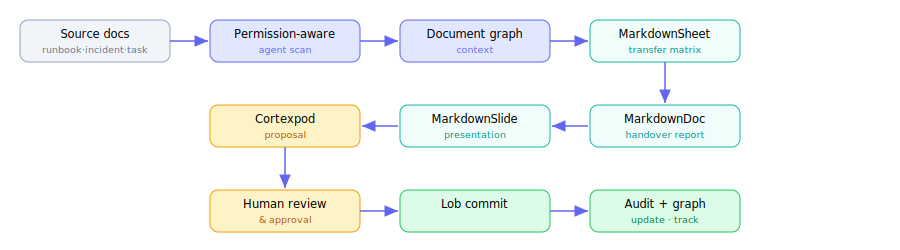
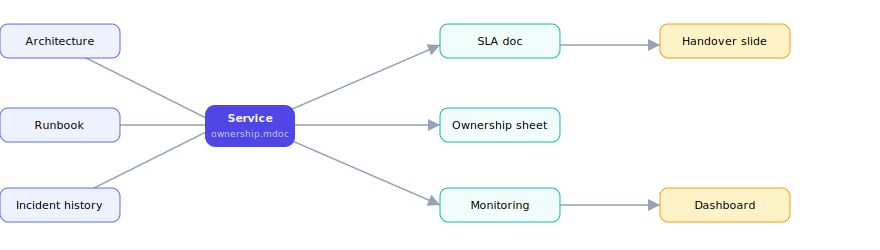

# 3 · Demo workflow
Create → structure → link → version → agent → export

---
layout: default
---

# Demo workflow overview - Employee Handover

Use case ROI rõ ràng: giảm knowledge loss, tăng tốc chuyển giao, tạo audit trail.

<div class="flex justify-center mt-3">

</div>

<!--
Agent tạo cả một handover PACKAGE liên kết với nhau, không phải một file rời rạc.
-->

---
layout: two-cols
layoutClass: gap-6
---

# Demo · Bước 1 - Authoring document

<div class="text-sm mt-2">
Tạo document → cấu trúc bằng Markdown + frontmatter + block ID. Agent scan permission-aware.
</div>

```md
---
title: Employee Handover Report
owner: platform-team
status: draft
generated_by: HandoverAgent
---

# Executive Summary
# Scope of Ownership
# Known Risks           {#risk}
# Open Tasks            {#tasks}
# Recommended Next Owner {#next}
# Appendix: Sources     {#src}
```

::right::

<div class="mt-14 text-sm">

### Knowledge Scan Summary
<div class="mt-2 p-3 rounded-lg bg-slate-100 dark:bg-slate-800 text-xs font-mono">
8 service documents found<br>
4 runbooks found<br>
12 open tasks found<br>
3 incidents found<br>
2 outdated docs detected<br>
1 missing backup owner<br>
<span class="text-rose-500">5 docs excluded by permission</span>
</div>

<div class="mt-3 px-2 py-1.5 rounded bg-amber-50 dark:bg-amber-900/20 text-xs">
⚖️ Agent không tìm kiếm mù - scan theo <b>permission · scope · policy</b>.
</div>

</div>

---
layout: default
---

# Demo · Bước 2 - Linking context (document graph)

Mỗi tài liệu là một node. Liên kết cho phép impact analysis, stale detection, provenance.

<div class="flex justify-center mt-4">

</div>

<div class="text-center text-sm opacity-70 mt-1">"Nếu owner nghỉ việc → tài liệu nào ảnh hưởng? Slide lấy data từ sheet nào? Sheet đã update sau incident chưa?"</div>

---
layout: default
---

# Demo · Bước 3 - Versioning & comparison

Lob so sánh <b>semantic</b>, không chỉ text. Reviewer thấy đúng ý nghĩa thay đổi.

<div class="grid grid-cols-2 gap-6 mt-4 text-xs">

<div class="p-3 rounded-lg border border-gray-300 dark:border-gray-600">
<div class="font-bold mb-2">📄 MarkdownDoc - section "Known Risks"</div>
<div class="font-mono bg-slate-100 dark:bg-slate-800 p-2 rounded">
<span class="text-emerald-600">+ Added 2 new risks</span><br>
<span class="text-rose-500">- Removed outdated deploy warning</span><br>
+ Linked to incident INC-2026-07<br>
<span class="text-amber-600">≈ Risk level: Medium → High</span>
</div>
</div>

<div class="p-3 rounded-lg border border-gray-300 dark:border-gray-600">
<div class="font-bold mb-2">📊 MarkdownSheet - rows</div>
<div class="font-mono bg-slate-100 dark:bg-slate-800 p-2 rounded">
≈ payment-service transfer owner updated<br>
<span class="text-emerald-600">≈ documentation: 60% → 85%</span><br>
<span class="text-amber-600">≈ risk score: 8.4 → 5.1 (recalc)</span>
</div>
</div>

<div class="p-3 rounded-lg border border-gray-300 dark:border-gray-600 col-span-2">
<div class="font-bold mb-2">📽️ MarkdownSlide - slide 7</div>
<div class="font-mono bg-slate-100 dark:bg-slate-800 p-2 rounded">
≈ risk chart updated · source sheet v12 → v13 · speaker note regenerated · <span class="text-emerald-600">slide marked reviewed</span>
</div>
</div>

</div>

<!--
Merge theo policy: legal content cần legal reviewer, financial number cần finance approval, report từ stale sheet không được merge.
-->

---
layout: default
---

# Demo · Bước 4 - Agent-assisted editing (proposal)

Agent proposal ≈ Pull Request cho document/slide/sheet/workflow.

<div class="grid grid-cols-2 gap-6 mt-3">

<div class="text-xs">

```text
Proposal: Generate handover package
────────────────────────────────
Files created:
 - handover-report.mdoc
 - service-ownership.msheet
 - handover.mslide
Files updated:
 - service-index.mdoc
Affected graph nodes:
 - payment-service
 - notification-service
Validation:
 ✓ schema passed
 ⚠ 2 missing-documentation warnings
Suggested reviewers:
 - Team Lead, Next Owner
```

</div>

<div class="text-sm">

### Reviewer có thể
<div class="mt-2 flex flex-col gap-1.5 text-xs">
<div class="px-2 py-1 rounded bg-indigo-50 dark:bg-indigo-900/20">👁️ Xem diff · source · generated artifact</div>
<div class="px-2 py-1 rounded bg-indigo-50 dark:bg-indigo-900/20">💬 Comment vào section / slide / row</div>
<div class="px-2 py-1 rounded bg-emerald-50 dark:bg-emerald-900/20">✅ Approve toàn bộ / một phần</div>
<div class="px-2 py-1 rounded bg-amber-50 dark:bg-amber-900/20">🔁 Yêu cầu Agent chỉnh · lock section</div>
<div class="px-2 py-1 rounded bg-rose-50 dark:bg-rose-900/20">↩️ Reject / rollback</div>
</div>

<div class="mt-3 px-2 py-1.5 rounded border-l-4 border-emerald-500 bg-emerald-50 dark:bg-emerald-900/20 text-xs">
Sau approve → commit vào Lob → graph & dashboard refresh → export/share (PDF, deck, HTML).
</div>

</div>

</div>
