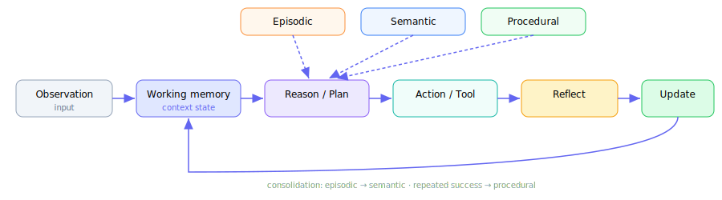
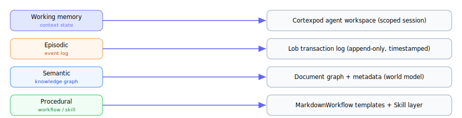

# 5 · Agent Memory
Working · Episodic · Semantic · Procedural — bốn lớp bộ nhớ của một AI Agent

---
layout: default
---

# Bốn lớp bộ nhớ: từ não người sang AI Agent

<div class="text-sm mt-1 opacity-80">
Dưới góc nhìn <b>agent development memory workflows</b>, memory của não có 4 lớp — tương ứng 4 kiểu bộ nhớ phục vụ: <b>hiểu ngữ cảnh · ghi nhớ trải nghiệm · tích lũy tri thức · hành động thành thạo</b>.
</div>

<div class="grid grid-cols-2 gap-4 mt-5 text-sm">

<div class="p-4 rounded-lg border-l-4 border-indigo-500 bg-indigo-50 dark:bg-indigo-900/20">
<div class="text-xl">🧠 Working memory</div>
<div class="mt-1"><b>"Agent đang nghĩ gì ngay lúc này"</b></div>
<div class="text-xs opacity-70 mt-1">Context hiện tại · rất ngắn hạn</div>
</div>

<div class="p-4 rounded-lg border-l-4 border-orange-500 bg-orange-50 dark:bg-orange-900/20">
<div class="text-xl">📖 Episodic memory</div>
<div class="mt-1"><b>"Agent đã trải qua chuyện gì"</b></div>
<div class="text-xs opacity-70 mt-1">Timeline sự kiện · dài hạn</div>
</div>

<div class="p-4 rounded-lg border-l-4 border-blue-500 bg-blue-50 dark:bg-blue-900/20">
<div class="text-xl">🌐 Semantic memory</div>
<div class="mt-1"><b>"Agent biết gì về thế giới / user / project"</b></div>
<div class="text-xs opacity-70 mt-1">Knowledge base · dài hạn</div>
</div>

<div class="p-4 rounded-lg border-l-4 border-green-500 bg-green-50 dark:bg-green-900/20">
<div class="text-xl">🛠️ Procedural memory</div>
<div class="mt-1"><b>"Agent biết làm việc như thế nào"</b></div>
<div class="text-xs opacity-70 mt-1">Skills / workflows · dài hạn</div>
</div>

</div>

<!--
Một Agent mạnh không chỉ cần LLM tốt — nó cần một memory workflow tốt. Đây là thứ biến chatbot từng lượt thành hệ thống có tính liên tục, học hỏi, trưởng thành.
-->

---
layout: default
---

# Kiến trúc memory của Agent

<div class="text-sm opacity-80">
Working memory là "cửa ngõ"; episodic · semantic · procedural được <b>retrieve</b> vào để reasoning; sau khi hành động, agent <b>reflect</b> và <b>update</b> memory.
</div>

<div class="flex justify-center mt-2">

</div>

<div class="mt-2 mx-auto max-w-4xl text-xs px-3 py-2 rounded bg-slate-50 dark:bg-slate-800 border-l-4 border-indigo-400">
<code>Observation → Working Memory → Reasoning/Planning → Retrieve (Episodic · Semantic · Procedural) → Action/Tool → Reflection → Memory Update</code>
</div>

---
layout: two-cols
layoutClass: gap-6
---

# 🧠 Working memory

## "Agent đang nghĩ gì ngay lúc này"

<div class="text-sm mt-2">
<b>Não:</b> bộ nhớ ngắn hạn giữ thông tin đang xử lý (tên biến, logic hàm, mục tiêu bug).<br>
<b>Agent:</b> chính là <b>context hiện tại</b>.
</div>

```txt
User goal: tạo MarkdownSheet
Current task: tìm spreadsheet engine
Constraints: Markdown-native, CSV-first,
             formula, chart, collaboration
State: đang so sánh Luckysheet · Univer · HyperFormula
```

<div class="mt-2 text-xs opacity-70">Nằm ở: LLM context window · scratchpad · task state · temporary variables · short-term planner.</div>

::right::

<div class="mt-14 text-sm">

### Chức năng
<div class="mt-2 flex flex-col gap-1.5 text-xs">
<div class="px-2 py-1 rounded bg-indigo-50 dark:bg-indigo-900/20">🎯 Giữ mục tiêu hiện tại</div>
<div class="px-2 py-1 rounded bg-indigo-50 dark:bg-indigo-900/20">📌 Giữ constraint của user</div>
<div class="px-2 py-1 rounded bg-indigo-50 dark:bg-indigo-900/20">🧩 Giữ intermediate reasoning</div>
<div class="px-2 py-1 rounded bg-indigo-50 dark:bg-indigo-900/20">🔧 Điều phối tool calls</div>
</div>

<div class="mt-3 px-2 py-1.5 rounded bg-rose-50 dark:bg-rose-900/20 text-xs">
⚠️ Dễ <b>quá tải</b> (context window có hạn) → summarize · compress · prioritize · drop irrelevant · promote lên long-term.
</div>

</div>

---
layout: two-cols
layoutClass: gap-6
---

# 📖 Episodic memory

## "Agent đã trải qua chuyện gì"

<div class="text-sm mt-2">
<b>Não:</b> ký ức về sự kiện cụ thể — chuyện gì, khi nào, với ai.<br>
<b>Agent:</b> lịch sử tương tác & hành động <b>theo timeline</b>.
</div>

```json
{
  "time": "2026-07-06",
  "event": "User asked MarkdownSheet architecture",
  "entities": ["MarkdownSheet","CSV","formula engine"],
  "outcome": "Recommended engine architecture"
}
```

<div class="mt-2 text-xs opacity-70">Lưu: conversation logs · event timeline · task traces · tool-call history · decision history.</div>

::right::

<div class="mt-14 text-sm">

### Vai trò
<div class="mt-2 flex flex-col gap-1.5 text-xs">
<div class="px-2 py-1 rounded bg-orange-50 dark:bg-orange-900/20">👤 Personalization — nhớ lịch sử user</div>
<div class="px-2 py-1 rounded bg-orange-50 dark:bg-orange-900/20">🔗 Continuity — tiếp tục project cũ</div>
<div class="px-2 py-1 rounded bg-orange-50 dark:bg-orange-900/20">🐞 Debugging — biết agent đã làm gì</div>
<div class="px-2 py-1 rounded bg-orange-50 dark:bg-orange-900/20">📚 Learning from experience</div>
<div class="px-2 py-1 rounded bg-orange-50 dark:bg-orange-900/20">🗂️ Auditability</div>
</div>

<div class="mt-3 px-2 py-1.5 rounded bg-emerald-50 dark:bg-emerald-900/20 text-xs">
→ Trong MarkdownOffice: chính là <b>Lob transaction log</b> (append-only, timestamped).
</div>

</div>

---
layout: two-cols
layoutClass: gap-6
---

# 🌐 Semantic memory

## "Agent biết gì về thế giới / user / project"

<div class="text-sm mt-2">
<b>Não:</b> kiến thức tổng quát, không gắn sự kiện cụ thể.<br>
<b>Agent:</b> <b>knowledge base</b> — facts, concepts, relationships, rules.
</div>

```json
{
  "concept": "MarkdownOffice",
  "type": "product ecosystem",
  "components": ["Doc","Slide","Sheet"],
  "principles": ["Markdown-native","AST-driven",
                 "AI-agent-friendly"]
}
```

<div class="mt-2 text-xs opacity-70">Lưu: vector DB · knowledge graph · document index · RAG · ontology.</div>

::right::

<div class="mt-14 text-sm">

### Episodic vs Semantic
<div class="mt-2 text-xs">

| Episodic          | Semantic            |
| ----------------- | ------------------- |
| Gắn sự kiện       | Gắn tri thức        |
| Có thời gian      | Không cần thời gian |
| "Tôi đã làm gì?"  | "Tôi biết gì?"      |
| Log / timeline    | Knowledge graph     |

</div>

<div class="mt-3 px-2 py-1.5 rounded bg-blue-50 dark:bg-blue-900/20 text-xs">
→ Trong MarkdownOffice: chính là <b>document graph</b> — world model / project model của tổ chức.
</div>

</div>

---
layout: two-cols
layoutClass: gap-6
---

# 🛠️ Procedural memory

## "Agent biết làm việc như thế nào"

<div class="text-sm mt-2">
<b>Não:</b> cách làm một việc (đi xe đạp, debug code) — "biết làm ra sao", không chỉ "biết cái gì".<br>
<b>Agent:</b> skills · tools · routines · playbooks · workflows.
</div>

```txt
Workflow: Fix bug in codebase
1. Reproduce issue
2. Inspect logs
3. Locate failing module
4. Patch code
5. Run tests
6. Summarize change
```

<div class="mt-2 text-xs opacity-70">Lưu: prompt templates · tool-use policies · workflow graphs · reusable skills · reflection heuristics.</div>

::right::

<div class="mt-14 text-sm">

### Vai trò
<div class="mt-2 flex flex-col gap-1.5 text-xs">
<div class="px-2 py-1 rounded bg-green-50 dark:bg-green-900/20">♻️ Reusability — không nghĩ lại từ đầu</div>
<div class="px-2 py-1 rounded bg-green-50 dark:bg-green-900/20">📏 Consistency — quy trình ổn định</div>
<div class="px-2 py-1 rounded bg-green-50 dark:bg-green-900/20">🎓 Skill acquisition — tạo kỹ năng mới</div>
<div class="px-2 py-1 rounded bg-green-50 dark:bg-green-900/20">🤝 Multi-agent orchestration</div>
</div>

<div class="mt-3 px-2 py-1.5 rounded bg-violet-50 dark:bg-violet-900/20 text-xs">
→ Trong MarkdownOffice: chính là <b>MarkdownWorkflow + Skill layer</b>.
</div>

</div>

---
layout: default
---

# Bảng mapping: Não ↔ AI Agent

<div class="mt-4 text-sm">

| Brain Memory | Agent Memory     | Lưu cái gì?               | Thời gian sống | Ví dụ                              |
| ------------ | ---------------- | ------------------------- | -------------- | ---------------------------------- |
| Working      | Context state    | Task hiện tại             | Rất ngắn       | Đang phân tích MarkdownSheet       |
| Episodic     | Event log        | Trải nghiệm đã xảy ra     | Dài hạn        | User từng hỏi về R2                |
| Semantic     | Knowledge base   | Tri thức, facts, concepts | Dài hạn        | MarkdownOffice gồm Doc/Slide/Sheet |
| Procedural   | Skills/workflows | Cách làm                  | Dài hạn        | Cách research open-source stack    |

</div>

<div class="mt-4 p-3 rounded-lg border-l-4 border-amber-500 bg-amber-50 dark:bg-amber-900/20 text-sm">
⚠️ <b>Không gom cả 4 vào một vector DB duy nhất.</b> Nên tách lớp: context state → working · timeline → episodic · knowledge graph/RAG → semantic · workflow/skills → procedural.
</div>

---
layout: default
---

# Memory workflow hoàn chỉnh

<div class="grid grid-cols-2 gap-6 mt-2">

<div class="text-xs">

```txt
1. Observe    — input từ user/tool/file/hệ thống
2. Encode     — trích entity, intent, facts, events
3. Classify   — working? episodic? semantic? procedural?
4. Store      — lưu vào đúng memory layer
5. Retrieve   — task mới → lấy memory liên quan
6. Reason     — memory + context → lập kế hoạch
7. Act        — gọi tool, viết code, tạo tài liệu
8. Reflect    — đúng/sai, hiệu quả/chưa
9. Consolidate— trải nghiệm → tri thức / quy trình mới
```

</div>

<div class="text-sm">

### Cùng một thông tin, phân loại khác nhau
<div class="mt-2 flex flex-col gap-1.5 text-xs">
<div class="px-2 py-1 rounded bg-indigo-50 dark:bg-indigo-900/20">"User đang hỏi về agent memory" → <b>working</b></div>
<div class="px-2 py-1 rounded bg-orange-50 dark:bg-orange-900/20">"06/07/2026 user hỏi về 4 loại memory" → <b>episodic</b></div>
<div class="px-2 py-1 rounded bg-blue-50 dark:bg-blue-900/20">"Agent memory có 4 loại chính…" → <b>semantic</b></div>
<div class="px-2 py-1 rounded bg-green-50 dark:bg-green-900/20">"Nên dùng bảng mapping não ↔ agent" → <b>procedural</b></div>
</div>

<div class="mt-3 px-2 py-1.5 rounded bg-slate-100 dark:bg-slate-800 text-xs">
Điểm mấu chốt: <b>không phải memory nào cũng lưu giống nhau</b>.
</div>

</div>

</div>

---
layout: default
---

# Consolidation — Agent "trưởng thành" theo thời gian

Trong não, memory được <b>củng cố</b> qua thời gian. Agent cũng nên có quá trình tương tự.

<div class="flex justify-center my-4">
<div class="flex items-center gap-3 text-sm">
  <div class="px-3 py-2 rounded-lg bg-orange-50 dark:bg-orange-900/20 border border-orange-300 dark:border-orange-700">Episodic lặp lại</div>
  <div class="text-xl">→</div>
  <div class="px-3 py-2 rounded-lg bg-blue-50 dark:bg-blue-900/20 border border-blue-300 dark:border-blue-700">Semantic (tri thức ổn định)</div>
</div>
</div>

<div class="flex justify-center mb-4">
<div class="flex items-center gap-3 text-sm">
  <div class="px-3 py-2 rounded-lg bg-orange-50 dark:bg-orange-900/20 border border-orange-300 dark:border-orange-700">Repeated successful actions</div>
  <div class="text-xl">→</div>
  <div class="px-3 py-2 rounded-lg bg-green-50 dark:bg-green-900/20 border border-green-300 dark:border-green-700">Procedural (quy trình mới)</div>
</div>
</div>

<div class="grid grid-cols-2 gap-4 text-xs mt-2">
<div class="px-3 py-2 rounded bg-slate-100 dark:bg-slate-800">
Nhiều episodic: <i>"user ưu tiên Markdown-native · thích architecture rõ ràng · dùng SvelteKit, Erlang/OTP, Cloudflare"</i><br>→ <b>Semantic:</b> user đang xây MarkdownOffice, hệ sinh thái Office AI-native.
</div>
<div class="px-3 py-2 rounded bg-slate-100 dark:bg-slate-800">
Nhiều lần trả lời thành công theo thứ tự cố định<br>→ <b>Procedural:</b> khi tư vấn sản phẩm, đi theo <i>architecture → MVP → tech stack → roadmap → risk</i>.
</div>
</div>

---
layout: default
---

# MarkdownOffice như một memory substrate có cấu trúc

Cả 4 lớp memory đều tìm được một "nhà" <b>bền vững, có version và audit</b> trong MarkdownOffice.

<div class="flex justify-center mt-3">

</div>

<div class="mt-2 text-center text-sm opacity-70">Structured · versioned · auditable → memory không "tan" khi phiên chat kết thúc. Đây cũng là cầu nối sang phần Harness.</div>

<!--
Working → Cortexpod workspace · Episodic → Lob log · Semantic → document graph · Procedural → MarkdownWorkflow/Skill. Chuyển tiếp: harness là bộ khung vận hành memory + loop + tool.
-->
