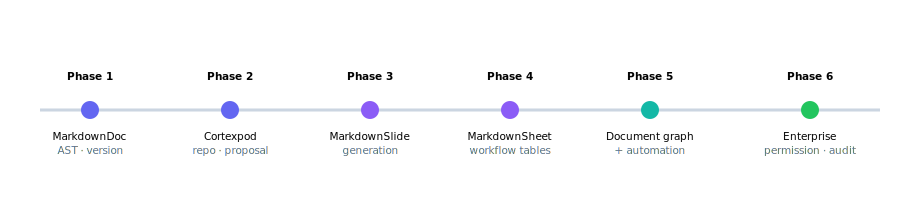

# 7 · Product strategy
Wedge · GTM · roadmap · platform vision

---
layout: default
---

# Product strategy - target users & wedge

### 🎯 Target users

| Đối tượng      | Cần gì                    | MarkdownOffice cấp     |
| -------------- | ------------------------- | ---------------------- |
| User phổ thông | UI giống Office           | Doc/Slide/Sheet viewer |
| Engineer       | Markdown · diff · version | Source · AST · Lob     |
| Manager        | Report · approval         | Dashboard · proposal   |
| AI Agent       | Structured context        | AST · graph · metadata |
| Enterprise     | Security · audit          | Permission · policy    |

### 🪓 Enterprise wedge

<b>Employee handover</b> - ROI rõ, pain thật

Structured report generation

Incident review · onboarding

Không clone toàn bộ Office. Bắt đầu từ <b>một workflow giá trị cao</b>, rồi mở rộng thành document monorepo.

---
layout: default
---

# Enterprise go-to-market & monetization

🚪

<b>Land</b> 
Handover / report agent cho một team. Value trong tuần đầu, không cần thay toàn bộ tooling.

📈

<b>Expand</b> 
Từ 1 team → nhiều team → document monorepo toàn tổ chức. Graph càng lớn, giá trị càng tăng.

🔒

<b>Lock-in giá trị</b> 
System of record cho organizational knowledge - càng dùng càng khó rời.

### 💰 Monetization direction

Seat: editor + viewer

Agent workflow / automation runs

Enterprise: permission · audit · compliance

Agent governance & policy tier

<!--
Monetizable through permission, audit, compliance, workflow và agent governance - không chỉ "AI editor".
-->

---
layout: default
---

# Platform roadmap

Wedge nhỏ giá trị cao → mở rộng thành full enterprise document monorepo, không vỡ kiến trúc.

---
layout: default
---

# The ratchet loop - harness evolution

Từ <b>demo agent</b> → <b>production agent</b> là khoảng cách của cả một lớp hệ thống, không phải "thêm vài tính năng".

| Demo agent          | Production agent          |
| ------------------- | ------------------------- |
| Prompt dài = "não"  | Instruction hierarchy     |
| Tool không validate | Typed schema              |
| Không durable state | Resume · audit · rollback |
| Không verification  | Verification bắt buộc     |
| Quyền rộng          | Least privilege           |

<!--
Mỗi lần agent lỗi → thêm một guardrail vào harness → không bao giờ lùi lại. Đó là ratchet.
-->

---
layout: default
---

# Final vision

Tương lai của tài liệu doanh nghiệp là <b>structured · versioned · Agent-native</b> - nơi con người và AI Agent cùng tạo, review, version, trình bày và tự động hóa.

<!-- 

 -->

| Trước đây               | Sau MarkdownOffice                    |
| ----------------------- | ------------------------------------- |
| Tệp tài liệu phân tán   | Monorepo tài liệu tập trung           |
| Sao chép thủ công       | Sinh nội dung dựa trên document graph |
| Quản lý phiên bản yếu   | Giao dịch được bảo chứng bởi Lob      |
| Chỉ con người chỉnh sửa | Cộng tác giữa con người và Agent      |
| Slide tĩnh              | Bài thuyết trình liên kết với nguồn   |
| Kiểm toán không rõ ràng | Truy vết đầy đủ toàn bộ thay đổi      |

GitHub for enterprise documents. Microsoft Office for AI Agents.

<!--
Cơ hội xây lại nền tảng tài liệu doanh nghiệp từ đầu cho thời đại AI Agent.
-->

---
layout: center
class: text-center
---

# Cảm ơn - Q&A

MarkdownOffice: LLM-first, markdown-native document agent cho enterprise monorepo.

  MarkdownDoc · Sheet · Slide · Jira
  Cortexpod + Lob
  Agent + Memory + Harness

Rất mong nhận câu hỏi về kiến trúc, agent workflow, memory substrate và go-to-market.

<!--
Kết deck: mời thảo luận. Nhấn mạnh MarkdownOffice là category mới - AI-native document operating system.
--> 
